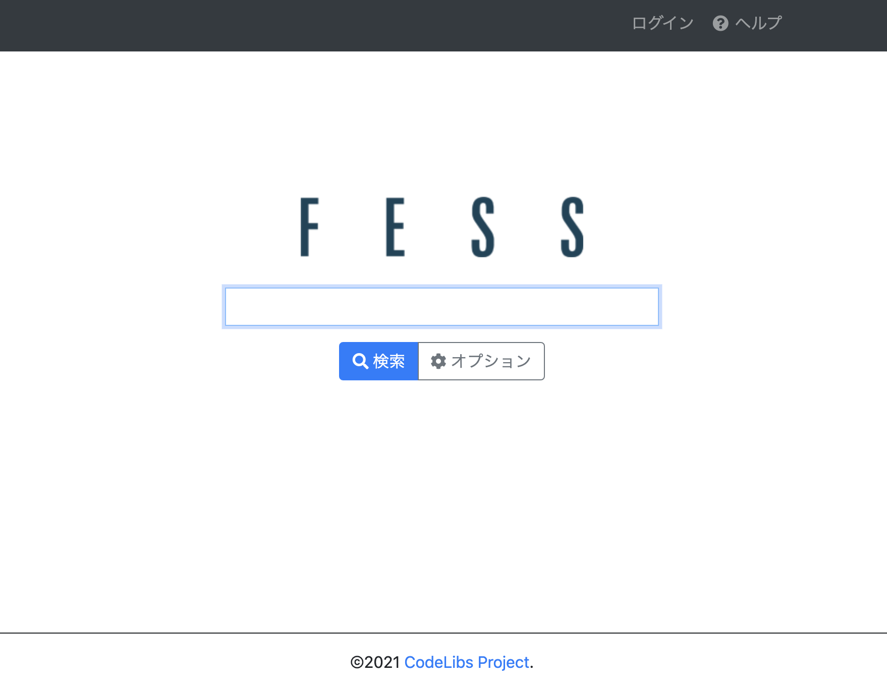

# terraform-fess-sample

## Description
Terraformを使用しAWS上にFessを起動するサンプル

## Features
- EC2起動時にFessをインストールするスクリプトを実行することで、TerraformによってAWSリソース作成からFessインストールまでを自動化している。  
- EC2以外に作成するのはネットワーク系リソースのみ。(デフォルトリソースの使用は避けている)  
- 東京リージョンに作成される。

## Requirement

- Terraformがインストールされていること
- AWSのプロファイルが存在し、EC2やネットワーク系リソースの作成権限があること

## Installation

```
git clone https://github.com/inayuky/terraform-fess-sample
```

## Usage

環境変数`AWS_DEFAULT_PROFILE`に使用するAWSのプロファイル名を設定する。

```
export AWS_DEFAULT_PROFILE=aws-profile-name
```

`terraform plan`でエラーが出力されないことを確認する。

```
cd terraform-fess-sample
terraform init
terraform plan
```

`terraform apply`で作成する。

```
terraform apply
```

以下のように作成が完了し、EC2のpublic ipが出力されることを確認する。

```
aws_vpc.this: Creating...
aws_vpc.this: Still creating... [10s elapsed]
aws_vpc.this: Creation complete after 12s [id=vpc-0421fe310b7f79985]
aws_internet_gateway.this: Creating...
aws_subnet.public: Creating...
aws_route_table.public: Creating...
aws_security_group.this: Creating...
aws_route_table.public: Creation complete after 0s [id=rtb-0300a5b26e1ac4398]
aws_internet_gateway.this: Creation complete after 0s [id=igw-0a3ef74ac374ec9c9]
aws_route.public: Creating...
aws_route.public: Creation complete after 2s [id=r-rtb-0300a5b26e1ac43981080289494]
aws_security_group.this: Creation complete after 6s [id=sg-0969ad34f56abe95e]
aws_security_group_rule.egress: Creating...
aws_security_group_rule.ingress: Creating...
aws_security_group_rule.ingress: Creation complete after 1s [id=sgrule-3958579072]
aws_security_group_rule.egress: Creation complete after 1s [id=sgrule-776018831]
aws_subnet.public: Still creating... [10s elapsed]
aws_subnet.public: Creation complete after 11s [id=subnet-07c5b99ecc83e97fc]
aws_route_table_association.public: Creating...
aws_instance.fess: Creating...
aws_route_table_association.public: Creation complete after 0s [id=rtbassoc-015efe383e221e7c0]
aws_instance.fess: Still creating... [10s elapsed]
aws_instance.fess: Still creating... [20s elapsed]
aws_instance.fess: Still creating... [30s elapsed]
aws_instance.fess: Creation complete after 32s [id=i-0035aed35a33dfea5]

Apply complete! Resources: 10 added, 0 changed, 0 destroyed.

Outputs:

public_ip = "13.231.227.218"
```

ブラウザ等で`http://public_ip:8080`にアクセスし、Fessの画面が表示されたら成功。(Fessが起動するまで数分かかる)



動作確認が終わったら、削除する。

```
terraform destroy
```

## License

MIT
